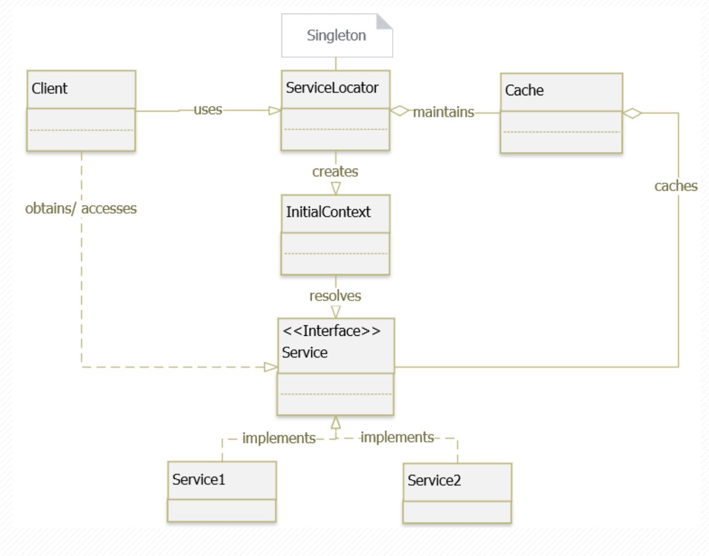

| title           | category     | language | tag                                  |
|-----------------|--------------|----------|--------------------------------------|
| Service Locator | Architecture | vi       | - Game Programing  - Performance |

# Mục đích
Đóng gói các quá trình liên quan tới việc lấy, 
sử dụng các service với một lớp abstraction mạnh (a strong abstraction layer)

# Class diagram

# Ứng dụng 
`Service locator` pattern được sử dụng khi chúng ta cần định vị , lấy ra, hoặc sử dụng các service khác  sử dụng JNDI  
(thường dư thưa và tốn resource lookup). `Service locator` giải quyết bài toán **expensive looking** bằng cách caching vào ram,
làm tăng hiệu năng của service và đưa đến khả năng mở rộng ứng dụng.

# Use Case
- Ứng dụng có một số lượng lớn các service kết nối có thể dùng thay phiên nhau heo từng trường hợp

# Lưu ý
- Pattern này vi phạm `Interface Segregation Principle` (ISP) khi cung cấp pattern để application có thể access 
tới một số lượng services mà có khả năng là không cần
- Tạo ra một số lượng hidden dependencies, những phụ thuộc này có thể break clients ở môi trường runtime. 

